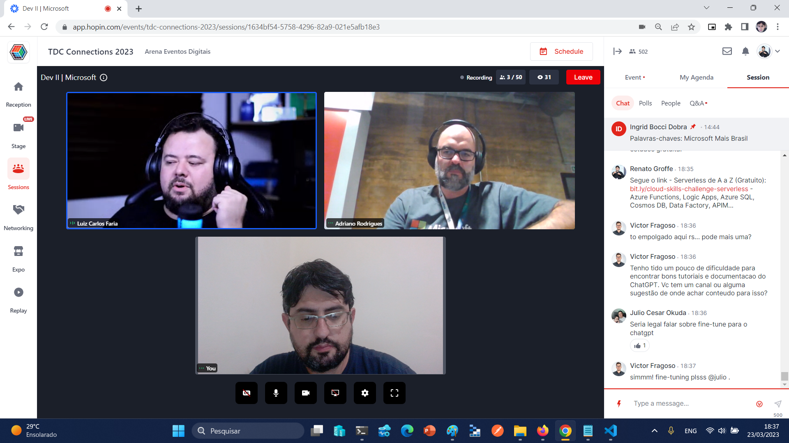
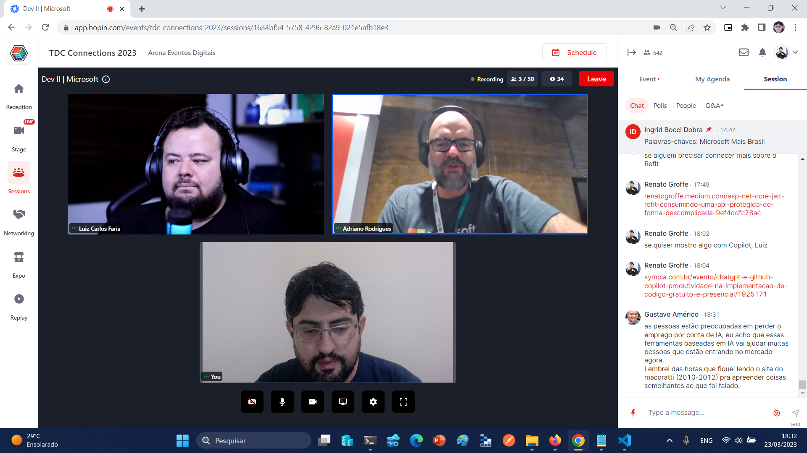
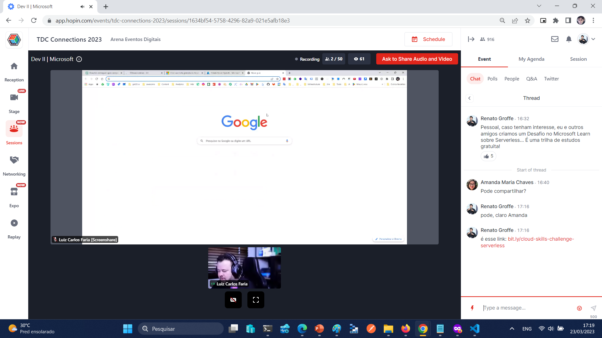

# Talk-OpenAI-TDC_Connections2023
Informações (dados gerais + prints) sobre apresentação online que abordou o **uso de iniciativas da OpenAI como ChatGPT e GitHub Copilot para acelerar o desenvolvimento de aplicações**. Talk realizada durante o [**TDC Connections 2023**](https://promo.thedevconf.com/conn23-mspart) no dia **23/03/2023 (quinta-feira)**.

Palestrantes:
- **Luiz Carlos Faria (Microsoft MVP, MTAC)**
- **Renato Groffe (Microsoft MVP, MTAC)**

Número de participantes: **61 pessoas** (pico de audiência ao longo da live)

Tecnologias abordadas: **GitHub Copilot, ChatGPT, Visual Studio Code, .NET 7, ASP.NET Core, SQL Server**

---

Prints da apresentação

